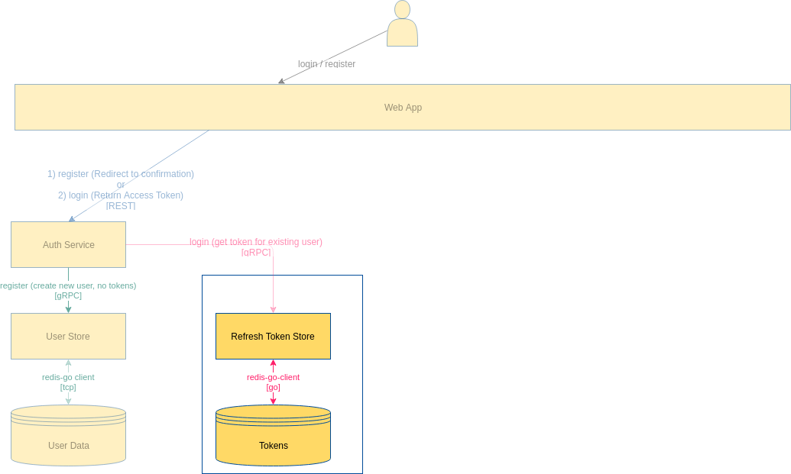

# go-refresh-token-store

This module manages the storage of the **refresh tokens**.

It listens to the port **5300**.



> Requires a valid refresh token, **cannot generate** one itself.

### Before all
* Have Go
* Have gRPC
* Have Docker
* Set Environment variables:
    * `REFRESH_TOKEN_STORE_REDIS_URL` (used in `./dal/client.go`)

installed.

### gRPC settings
Everything starts with designing the [protobuf](https://github.com/google/protobuf) file 
(`./proto/token.proto` for this project) and once the messages and services are designed
(or changed later) the following command should be run:
```sh
cd $GOPATH/src/github.com/vahdet/go-refresh-token-store
protoc -I proto proto/token.proto --go_out=plugins=grpc:proto
``` 

This command will generate (or recreate if it exists) a `.pb.go` file just beside itself. 
It is `./proto/token.pb.go` here and it allows implementing Go services, repositories, in short any Go code
behind the services defined in the `.proto` file.

For this case, the server implementation is performed in `./grpcserver/server.go` file.

### Git Tips for humble beings
The [StackOverflow answer](https://stackoverflow.com/a/23328996/4636715) resembles three lines of general purpose git commands
that can be used anytime a change is made and should be committed to `master` branch:

```bash
git add .
git commit -a -m "My classical message to be replaced"
git push
```
